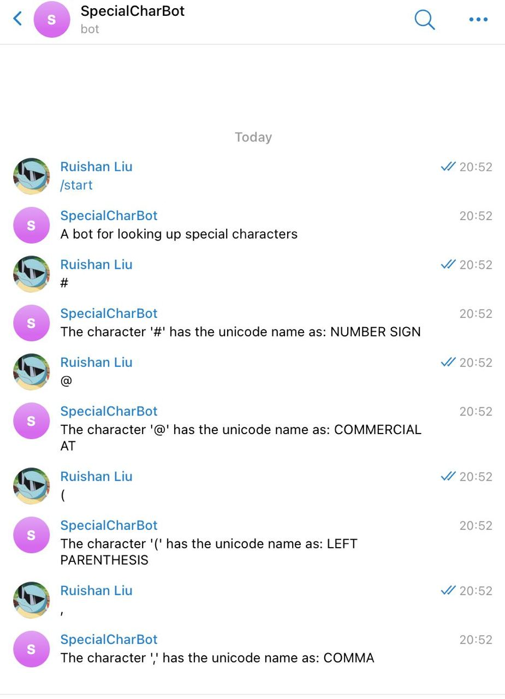

# [@SpecialCharBot](https://t.me/SpecialCharBot)

## introduction

Are you a non-native English struggling speaker like me? Have you even been in the embrassing situation that you don't know how to pronouce special characters such as / or { or ? in the talk just like me?

Unfornately, it's not easy for us to learn them. These characters are not in the textbook, not in the dictionary and hard to search in Google. 

So I develop this telegram bot to look up speical characters. just input any charcater and I'll return you the name.




## deployment

This bot is deployed on ec2 by docker.

```bash
# docker build
make docker build

# docker push
make docker push

#ssh to ec2

mkdir bot/resources
cd bot/resources
echo token=$bot_token > config.properties
echo username=$bot_username >> config.properties

# docker run
sudo docker run --pull always --rm -v $HOME/bot/resources:/usr/app/app/src/main/resources  ghcr.io/bucktoothsir/special_char_bot:latest
```

